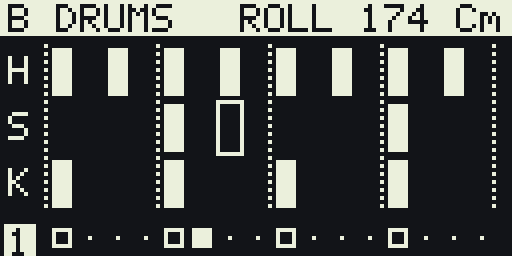
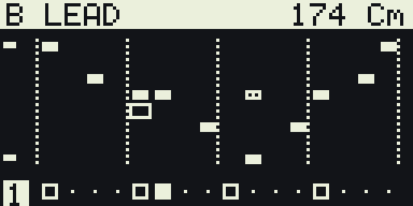
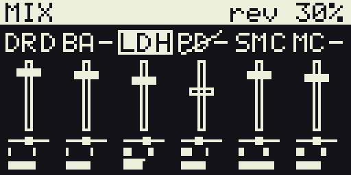
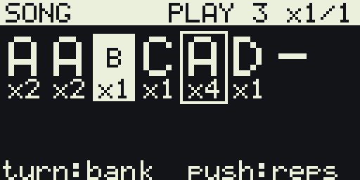

# ESP32-S3 SuperMini Audio Kit

An open-source, solderless, 3D-printable handheld built around the ESP32-S3
SuperMini. Microphone in, speaker and headphones out, a small OLED, an encoder,
a joystick, and room for a distance sensor and an IMU.

This repo will grow into everything needed to build one or sell one: firmware,
carrier PCB, enclosure, bill of materials, and assembly instructions.

**Status: five firmware applications, a printable case, a purchasing list.**
The firmware builds as one of:

| App | `tools/app.sh` | What it is |
|-----|----------------|------------|
| JAM | `jam` | Step sequencer and sampler for the boxed unit: six channels on a scale-locked grid, slices you can scratch, roll and chaos for breakcore, mixer with insert effects, eight pattern banks, a song page, autosave. Encoder and joystick only. |
| Looper | `looper` (default) | Hum, beatbox or whistle and get a track: up to 8 tracks on a fixed grid, scenes and an arrangement, stereo mix, autosave, WAV/MIDI export over a USB drive mode. |
| Faust showcase | `faust` | Mic through seven [Faust](https://faust.grame.fr) programs (zita reverb, pitch shift, wah, amp sim, flanger, compressor, a pitch-following synth), each with presets. |
| Hardware test | `test` | Mic to DAC with a wiring diagnosis on the screen and serial log, a boot-time test tone, delay/reverb/beat repeat. Flash this first on a new build. |
| Instrument | `instrument` | The older eight-mode voice instrument. |

## Parts

| Part | Role | Bus |
|------|------|-----|
| ESP32-S3 SuperMini | brain, native USB | |
| INMP441 | MEMS microphone | I2S (RX) |
| PCM5102A | line / headphone DAC | I2S (TX) |
| MAX98357A | 3 W speaker amp | I2S (TX) |
| 0.96" SSD1306 OLED | display | I2C |
| Rotary encoder with button | input | GPIO |
| Analog joystick with button | input | ADC1 + GPIO |
| VL53L0X (optional) | time-of-flight distance | I2C |
| MPU6050 (optional) | gyro + accelerometer | I2C |

All three audio chips share one I2S port. See [docs/pinmap.md](docs/pinmap.md)
for the wiring and why that works.

The current [minimal purchasing list](parts/minimal-kit.md) is **your carrier PCB
plus seven parts**: ESP32-S3, purple PCM5102A board, joystick board with pins,
bare encoder, round six-pin I2S mic, 0.96-inch I2C OLED and MPU6050 board.
Available as [PDF](parts/minimal-kit.pdf) and [CSV](parts/minimal-kit.csv).
The [earlier expanded research](parts/purchasing-kit.md) keeps the additional
options and CAD references. Shipping and exact module dimensions remain unverified.

## Repo layout

```
firmware/     ESP-IDF project (C, a little C++ for the Faust glue)
firmware/faust/  Faust sources; tools/faustgen.sh turns them into C++ under firmware/main/faust/
tools/        app.sh (switch application), faustgen.sh
docs/         pin map, wiring diagram, acoustics notes
enclosure/    parametric OpenSCAD case, renders and STLs (0.8 mm nozzle, heat-set inserts)
3d/           earlier concept bodies (slab, ocarina, cup)
parts/        purchasing lists, datasheets and drawings
images/       photos and rendered screens
hardware/     later: KiCad carrier PCB
```

## Build the firmware

Requires [ESP-IDF](https://docs.espressif.com/projects/esp-idf/en/stable/esp32s3/get-started/index.html)
v5.5 or newer with the `esp32s3` target installed.

```sh
. ~/esp/esp-idf/export.sh        # or wherever your IDF lives
cd firmware
idf.py set-target esp32s3
idf.py build
idf.py flash monitor
```

The SuperMini's USB-C is wired to the S3's native USB, so it usually flashes
without pressing anything. If it does not show up, hold BOOT, tap RESET,
release BOOT, then flash again.

Pick the application with `tools/app.sh jam` (or `looper`, `faust`, `test`,
`instrument`), which edits `sdkconfig` and rebuilds. Tunables live under
`idf.py menuconfig` -> `Kit firmware`: application, mic gain, sample rate,
tempo, encoder steps, OLED rotation, whether the speaker amp is always on.

Wiring note: the INMP441's L/R pin may go to GND or VDD, the firmware finds
which I2S slot carries the mic. The joystick's VRy goes to GPIO1 and VRx to
GPIO2 (see [docs/pinmap.md](docs/pinmap.md)).

## Using JAM

 
 

Four pages, cycled by holding the encoder for half a second: **PATTERN**,
**MIX**, **SONG**, **SETUP**. Push the encoder in and turn it to change
channel (DRUMS, BASS, LEAD, PAD, SAMPLE, MIC). Hold it 3 s to clear the
channel.

**PATTERN** is the step grid of the channel, two bars of 16 steps. Turn the
encoder or flick the joystick to move the cursor, tap the encoder to toggle
the cell. Drums have kick, snare and hat lanes. Melodic channels have one
row per degree of the scale chosen in SETUP plus the octave, so notes cannot
leave the key. PAD rows are chord degrees. SAMPLE plays the recording pitched
by row, or in SLICE mode one of eight slices per row, where a lit cell tapped
again plays in reverse. MIC is the live mic, only audible while selected;
tap the encoder there to record up to two seconds into the sampler.

Click the joystick for **perform** mode. On DRUMS the stick rolls the last
hit, from 1/8 to 1/64 by tilt, louder or softer along the other axis. On
SAMPLE it first scratches the recording like a record, click again and it
rolls with a pitch ramp. On BASS and LEAD it opens the filter and bends, on
PAD and MIC it pushes the reverb and delay sends. Hold the encoder and flick
up or down to switch pattern bank, A to H, instantly.

**MIX** shows a fader per channel with pan, reverb and delay sends, an insert
effect (drive, crush, chorus, phaser, wobble, tremolo) and its amount.
**SONG** chains banks with repeat counts, tap to play from the cursor.
**SETUP** has tempo up to 250, root and scale (major, minor, dorian,
mixolydian, harmonic minor, two pentatonics, blues), a drum pattern to load
into the grid, swing, CHAOS (the chance that a step rolls, drops, swaps or
reverses), the drum kit and synth presets, and COPY and CLEAR ALL.

Everything is saved two seconds after the last edit and comes back at
power-up.

## Using the looper

One encoder, one joystick, optional tilt sensor and distance sensor. Same
grammar everywhere:

| Gesture | Does |
|---------|------|
| turn | next / previous track (in the menu: move, or change a value) |
| push | record a take on this track; push again to cancel |
| hold 0.6 s | menu (in the menu: back) |
| hold 3 s | clear all patterns |
| joystick tilt | expression: brightness and pitch bend |
| joystick click | mute this track |
| joystick flick up / down | next / previous scene, switched at the loop start |
| joystick flick left / right | track |
| body tilt | vibrato (roll) and brightness (pitch) |
| hand over the distance sensor | space (reverb send) |

A take is exactly one loop. Push, the metronome counts in one bar (or waits
for the loop to come round once something is playing), the take records for
one loop and stops by itself. Takes overdub by default; Take -> Replace next
or Undo change that. Drums are beatboxed (kick / snare / hat by the sound's
band energies), bass, keys and lead are hummed or whistled and snapped to
the grid and the key, the vocal track is a hard-tuned voice recorded as
audio. The key locks on the first melodic take, or set it in Song -> Key.

Menu sections: **Take** (undo, replace, copy A here, clear), **Track**
(sound, volume, pan, reverb, delay, low cut, tone, mute, solo, add / delete
track), **Scene** (scene, song mode, arrangement), **Song** (tempo, bars,
key, count-in, metronome, quantise, swing, humanise, kit, mic gain, gate),
**Master** (pump, drive, tone), **Files** (export, save / load slot, new,
USB drive).

USB drive mode (Files -> USB drive, or hold the encoder at power-up) shows
the storage partition to the PC and makes the board a MIDI device. Drop
`kick.wav`, `snare.wav`, `hat.wav` into `kits/user/` for your own drum kit;
exports land in `export/` as one WAV per track, a stereo `mix.wav`,
`song.mid` and `song.txt`. Hold the button to return. Flashing needs the
board out of USB mode (or BOOT held at power-up).

The serial log prints the current track, scene, key, the voice tracker's
level and confidence, the DSP load with a per-section breakdown, and which
inputs were detected.

## Faust

Effects and the JAM synth voice are written in Faust under `firmware/faust/`.
After editing a `.dsp`, run `tools/faustgen.sh` (needs the `faust` compiler
on PATH) to regenerate the C++ classes under `firmware/main/faust/`, which
are committed so a normal build never needs Faust. Avoid table-based
oscillators on this chip, each costs 256 KB of internal RAM.

## Roadmap

- [x] Pin map
- [x] I2S loopback (mic -> DACs)
- [x] OLED, encoder and joystick input
- [x] ToF and IMU readouts (looper)
- [x] 3D-printed enclosure ([enclosure/](enclosure/), first revision)
- [x] Purchasing list ([parts/minimal-kit.md](parts/minimal-kit.md))
- [ ] Carrier PCB (KiCad) with sockets for every module
- [ ] Assembly guide

## License

Firmware and documentation: [MIT](LICENSE). Hardware files, when they land,
will be CERN-OHL-P.
