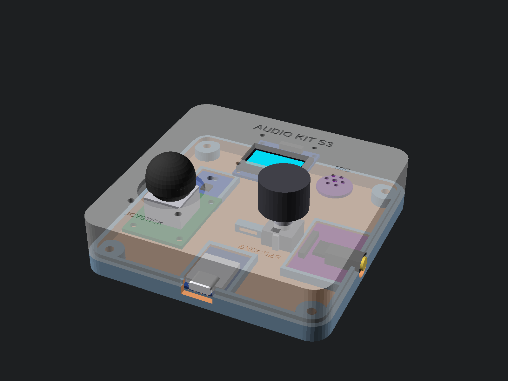
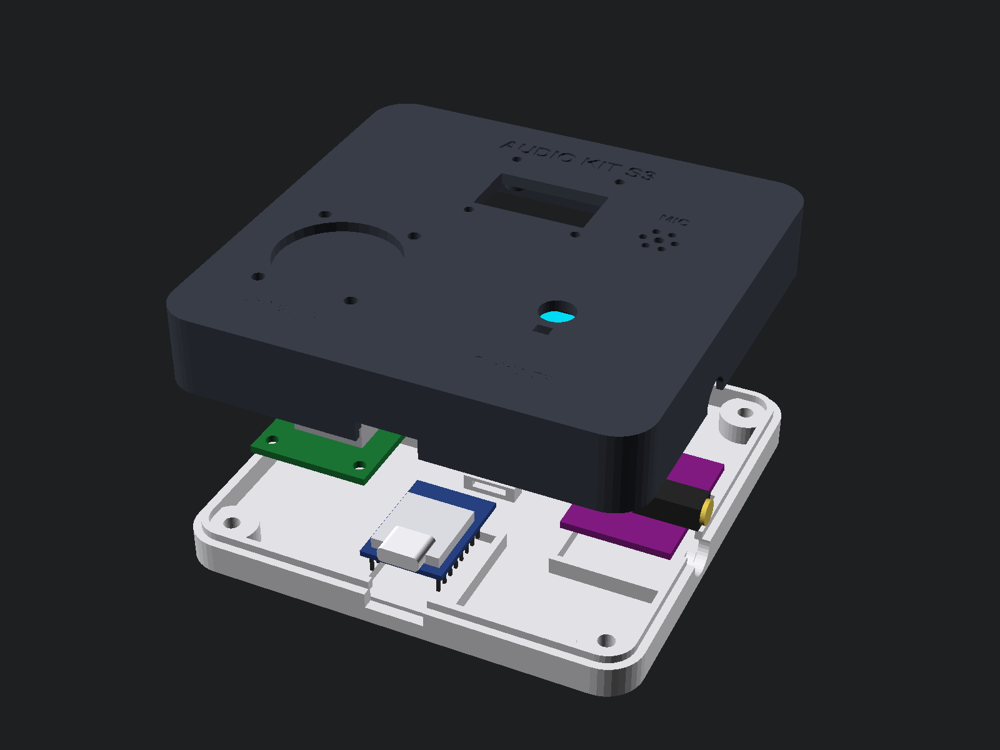
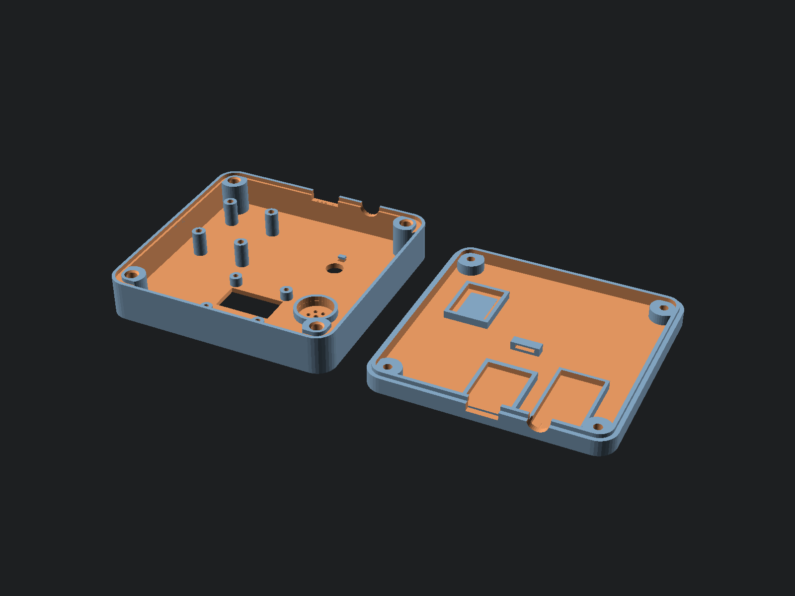

# 3D OpenSCAD Enclosure for ESP32-S3 Audio Kit (Shortlist Edition)

For the full build, use the [beginner assembly guide](../docs/assembly/README.md)
or [16-page printable PDF](../output/pdf/esp32-s3-supermini-assembly-guide.pdf).
It covers bench testing, wiring, dry-fit checks, and enclosure assembly. The
dimensions below describe the CAD; verify them against your actual boards,
headers, plugs, inserts, and screws before printing or fastening.

A custom, ergonomic, 3D-printable handheld enclosure designed specifically for the **six parts of the Minimal Audio Kit shortlist** (plus internal mounting for the MPU6050 IMU), optimized for **0.8 mm nozzle printing** and **brass heat-set threaded inserts**.



---

## 1. Overall Dimensions & Specifications

- **Outer Dimensions:** `100.0 mm` (Width, X) × `98.0 mm` (Length, Y) × `24.0 mm` (Height, Z)
- **Top Shell Height:** `17.0 mm`
- **Bottom Lid Height:** `7.0 mm` (parting line at Z = 7.0 mm)
- **Corner Radius:** `8.0 mm` rounded ergonomic corners
- **Wall Thickness:** `2.4 mm` (exactly 3 perimeters of 0.8 mm nozzle extrusion)
- **Floor & Ceiling Thickness:** `2.4 mm` (solid 6 layers at 0.40 mm)

---

## 2. The Six Shortlist Parts & Placement

| # | Part | Role & Specification | Enclosure Integration |
|---|---|---|---|
| **1** | **ESP32-S3 SuperMini** | ESP32-S3FH4R2, 4MB Flash / 2MB PSRAM, USB-C | Lower-center lid cradle (`X = 41.0 to 59.0 mm`); USB-C port cutout on bottom edge with cable shroud relief. |
| **2** | **PCM5102A I2S DAC** | **32 × 17 mm** purple board, 3.5mm jack on a short end, offset to one side. Size, jack edge, jack offset and which wall it exits are in the Customizer group *PCM5102A DAC board* in `enclosure.scad`. | Lid cradle along the right wall (`X = 68.5 to 85.5 mm`, `Y = 2.9 to 34.9 mm`), jack **exits through the front wall** beside the USB-C port. |
| **3** | **Analog Joystick** | KY-023-style module with fitted pins and thumb cap | Lower-left quadrant (`X = 22.5, Y = 32.5 mm`); 26.5 mm diameter dome aperture; 4 M2 internal screw bosses with **>3.7 mm clearance to ESP32 cradle** and **>5.2 mm to ESP32 PCB** (zero overlap). |
| **4** | **Rotary Encoder** | Bare EC11 with push switch and vertical shaft | Lower-right quadrant (`X = 70.0, Y = 32.5 mm`); 7.5 mm through-hole for M7 threaded bushing, anti-rotation locator notch, recessed dial bezel. |
| **5** | **I2S Microphone** | **Round 14.5 mm 6-pin board** (INMP441) | **Mounted on top layer next to the OLED display** (`X = 78.0, Y = 65.0 mm`); acoustic 7-hole rosette grille with conical chamfers, internal gasket seat, and circular retention collar (zero overlap with OLED). |
| **6** | **0.96-inch OLED** | SSD1306, 128×64, 4-pin I2C | Upper front center (`X = 36.35 to 63.65 mm, Y = 58.0 mm`); recessed beveled viewing window; 4 M2 mounting standoffs. |
| *(7)* | *MPU6050 IMU* | *GY-521 6-DoF accelerometer & gyro (motion sensor)* | *Internal retention cradle on lid floor; rigidly anchored to chassis for tilt sensing.* |

---

## 3. 0.8 mm Nozzle & Heat-Set Insert Engineering

### A. 0.8 mm Nozzle Geometries
Printing with a 0.8 mm nozzle requires walls, perimeters, and tolerances to be integer multiples of the extrusion line width:
- **Wall Thickness:** `2.4 mm` (exactly 3 solid perimeters of 0.8 mm).
- **Floor & Roof Thickness:** `2.4 mm` (6 solid layers at 0.40 mm layer height).
- **Alignment Lip (Tongue & Groove):** `1.6 mm` (exactly 2 solid perimeters).
- **Sliding Clearance (`tol`):** `0.40 mm` (accommodates 0.8 mm corner bulging for a smooth sliding fit).
- **Acoustic Grille Openings:** 7-hole rosette (center: 2.2 mm, surround: 1.8 mm) allows the 0.8 mm nozzle to lay down crisp circular paths without stringing or merging.
- **Labels:** Bold embossed/debossed typography with stroke widths exceeding 0.8 mm for clean legibility.

### B. Heavy-Duty Brass Heat-Set Threaded Inserts
Rather than self-tapping into weak plastic, the top shell contains thick, heavy-duty structural corner bosses designed for **heat-set brass threaded inserts**:
- **Default configuration:** `insert_type = "M3"`:
  - **Boss Outer Diameter:** `Ø11.5 mm` (providing **~3.5 mm solid wall thickness / ~4.5 continuous perimeters** around the brass insert).
  - **Insert Hole Diameter:** `Ø4.5 mm` (tailored for standard M3 heat-set inserts with OD ~4.6 mm).
  - **Insert Depth:** `5.8 mm` (for standard 4.0 mm – 5.7 mm insert lengths).
  - **Conical Lead-In Chamfer:** 0.8 mm deep 45° lead-in chamfer ensures the brass insert rests perfectly vertical and self-centers before touching with the soldering iron tip.
- **Selectable in OpenSCAD:** Supports `"M2"`, `"M2.5"`, or `"M3"` with matching screw clearances and counterbores.
- **Lid Screw Holes:** `Ø3.6 mm` pass-through clearance with `Ø7.2 mm × 3.2 mm` deep counterbores so M3 socket/pan head screws sit flush with the bottom surface.

---

## 4. Exploded Assembly



1. **Top Shell Prep & Assembly:**
   - Press four **M3 brass heat-set inserts** into the corner bosses using a soldering iron (set to ~230–250°C for PLA/PETG).
   - Fasten the **SSD1306 OLED** to the upper window bosses with four M2 screws.
   - Place a small foam/silicone gasket ring into the microphone seat on the top layer, press the **Round INMP441 mic** into its circular collar, and route leads.
   - Insert the **EC11 Encoder** through its panel hole and tighten the M7 nut on the outside; press the knob onto the 6mm D-shaft.
   - Mount the **KY-023 Joystick** onto its four standoff bosses using four M2 screws.
2. **Bottom Lid Assembly:**
   - Slide the **ESP32-S3 SuperMini** into its cradle (USB-C facing outward on the bottom edge).
   - Slide the **PCM5102A DAC** into its cradle (3.5mm stereo jack facing outward through the front wall cutout beside the USB-C).
   - Press the **MPU6050 IMU** into its internal retention cradle.
   - Wire connections according to [`docs/pinmap.md`](../docs/pinmap.md) and secure wires through the cable anchor loop.
3. **Closing Case:**
   - Place the bottom lid onto the top shell (the 1.6 mm interlocking lip aligns both halves smoothly).
   - Fasten with four **M3 × 10 mm (or 12 mm)** socket-head or pan-head machine screws from the underside (counterbored flush).

---

## 5. 3D Printing Guidelines

Both parts are designed for **100% support-free printing**:



- **Print Bed Setup:** Open [`print_bed.scad`](print_bed.scad) or load [`out/print_bed.stl`](out/print_bed.stl) directly into your slicer (OrcaSlicer, PrusaSlicer, Bambu Studio, Cura).
- **Top Shell Orientation:** Printed **top-face down** flat on the build plate (Z=0). Heat-set insert bosses and walls grow vertically upward.
- **Bottom Lid Orientation:** Printed **bottom-face down** flat on the build plate (Z=0).
- **Nozzle Diameter:** 0.8 mm
- **Recommended Material:** PLA, PLA+, or PETG.
- **Layer Height:** 0.32 mm – 0.40 mm (fast printing, ~1 hour total print time!).
- **Perimeters / Walls:** 3 perimeters (gives 100% solid 2.4 mm walls).
- **Top / Bottom Solid Layers:** 4 to 6 layers.
- **Infill:** 20% to 30% (Gyroid or Grid).
- **Supports:** **NONE** (0% support needed).

---

## 6. Hardware Bill of Materials

| Item | Quantity | Purpose |
|---|---|---|
| M3 brass heat-set inserts (OD ~4.6 mm, L ~4–5.7 mm) | 4 | Corner fasteners in Top Shell (or M2.5 / M2) |
| M3 × 10 mm (or 12 mm) machine screws | 4 | Case closure through Bottom Lid (counterbored flush) |
| M2 × 4 mm screws | 4 | OLED display mounting |
| M2 × 6 mm screws | 4 | KY-023 Joystick module mounting |
| EC11 M7 nut & washer | 1 | Rotary encoder panel fixing |
| Foam/silicone gasket ring (~10–14 mm OD) | 1 | Microphone acoustic isolation |
| Rubber bumper feet (~8 mm diameter) | 4 | Optional non-slip feet for lid recesses |

---

## 7. Files & Customization

- [`enclosure.scad`](enclosure.scad): Main parametric OpenSCAD design script.
- [`parts.scad`](parts.scad): 3D component models and negative cutouts library.
- [`print_bed.scad`](print_bed.scad): Build plate layout file for single-plate slicing.
- [`render.sh`](render.sh): Shell script to render PNG previews and export STLs.
- [`out/`](out/):
  - [`print_bed.stl`](out/print_bed.stl): Ready-to-slice 2-in-1 build plate STL (Top Shell + Bottom Lid).
  - [`shell.stl`](out/shell.stl): Ready-to-slice Top Shell STL.
  - [`lid.stl`](out/lid.stl): Ready-to-slice Bottom Lid STL.
  - `preview.png`: Transparent assembled preview.
  - `exploded.png`: Exploded assembly diagram.
  - `assembled.png`: Solid external case view.
  - `print_bed.png`: Both parts arranged flat for 3D printing.

### CLI Rendering Commands

```bash
# Render all views and STLs
./render.sh

# Or open interactively in OpenSCAD
openscad enclosure.scad
```
